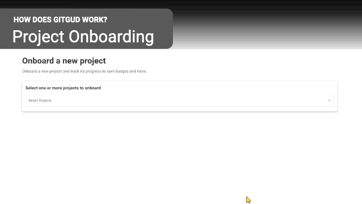
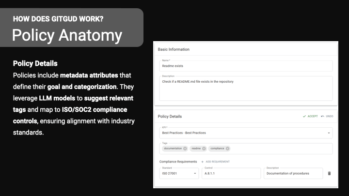
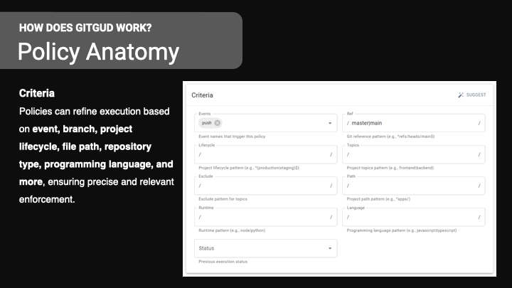
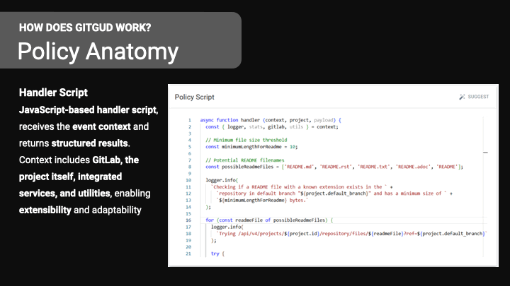
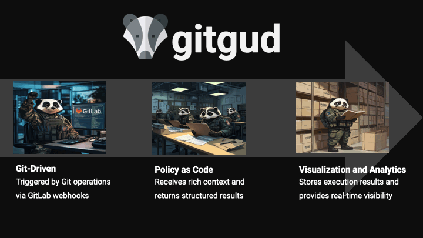

# GitGud 🚀

<p align="center">
  
</p>


**Trust, but verify**

GitGud is an open-source DevOps compliance and best practices enforcement platform designed to streamline, automate, and scale DevOps adoption across your organization.

---

## 🌟 Introduction

GitGud transforms fragmented DevOps practices into unified, automated, and transparent workflows. It ensures your teams consistently follow best practices, enhancing real-time compliance, visibility, and collaboration across your entire development organization.

---

## 🎯 Motivation

Traditional DevOps approaches often face:

- **Siloed DevOps Practices:** Best practices are fragmented and inconsistently documented.
- **Lack of Visibility & Coverage:** Difficulty tracking adherence to standards across teams.
- **Slow & Manual Scaling:** Inefficient onboarding of teams to standardized practices.

GitGud addresses these challenges by offering real-time, automated, and scalable compliance enforcement directly integrated with your Git workflows.

---

## 📚 Features

### 🌀 Git-Driven Workflows

GitGud seamlessly integrates with GitLab webhooks to trigger policy execution based on Git operations, ensuring continuous adherence to best practices.

### 📊 Real-Time Visualization & Analytics

Track policy execution results and compliance status across all projects in real-time. Get immediate visibility and actionable insights into your organization's DevOps health.

### 📜 Policy as Code

Define policies as structured, version-controlled JavaScript handler scripts. Policies include:

- **Metadata:** Clearly documented goals and categorization.
- **Criteria:** Context-aware execution based on events, branch types, project lifecycles, file paths, repository types, programming languages, and more.
- **Compliance Mapping:** Leverage Large Language Models (LLMs) to automatically suggest relevant tags and align with industry standards such as ISO and SOC2.

### 🚧 Extensible & Customizable

Policy scripts receive rich contextual data, including information from:

- GitLab events
- Project details
- Integrated services and utilities

This ensures maximum adaptability and customization for your organization's unique needs.

---

## GitGud Example Policies

| Policy Name                                | KPI             | Description |
|-------------------------------------------|-----------------|-------------|
| Readme exists                              | Best Practices  | Check if a README.md file exists in the repository. |
| Minimal Replicas Are Configured            | Resilience      | Ensure services have at least 2 replicas for high availability. |
| Repository Must Have Tests                 | Compliance      | Ensure the repository includes automated tests to validate functionality. |
| Code Coverage Must Be Above 80%            | Best Practices  | Ensure at least 80% of the code is covered by automated tests. |
| Dependency Lock File Exists                | Best Practices  | Ensure a dependency lock file exists in the repository. |
| Git Ignore is Configured                   | Best Practices  | Ensure a .gitignore file exists in the repository. |
| Contributing Guidelines Exist              | Best Practices  | Ensure a CONTRIBUTING.md file exists in the repository. |
| Docker Compose / Tiltfile Exists           | Best Practices  | Ensure a Docker Compose or Tiltfile exists in the repository. |
| Secrets Are Not in Code                    | Compliance      | Ensure no hardcoded secrets (API keys, passwords, private keys) exist in the repository. |
| Code Uses Approved Dependencies            | Compliance      | Ensure dependencies come from approved internal or trusted sources. |
| Branch Protection Rules Exist              | Compliance      | Ensure branch protection rules are in place. |
| Multi-Site High Availability is Configured | Resilience      | Ensure critical services are deployed across multiple on-prem sites. |
| Container Images Are Scanned for Vulnerabilities | Compliance | Ensure container images are scanned for vulnerabilities before deployment. |
| RBAC Policies Are Enforced                 | Compliance      | Ensure Kubernetes Role-Based Access Control (RBAC) is properly configured. |
| Audit Logging is Enabled                   | Compliance      | Ensure services and infrastructure components have audit logging enabled. |
| No Hardcoded Configuration                 | Compliance      | Ensure applications retrieve configuration from environment variables or configuration management tools. |
| Artifacts Are Stored in an Internal Registry | Compliance    | Ensure build artifacts and container images are only pulled from a trusted internal registry. |
| TLS is Enforced for Ingress                | Resilience      | Ensure all exposed services enforce TLS encryption to protect data in transit. |
| Services Have Health Checks                | Resilience      | Ensure Kubernetes deployments have liveness and readiness probes for service monitoring. |
| Backups Are Configured and Tested          | Resilience      | Ensure critical data has a backup strategy with automated testing. |
| Auto-Restart Policies Are Enabled          | Resilience      | Ensure Kubernetes workloads have restart policies for automatic recovery. |
| Disaster Recovery Plan Exists              | Resilience      | Ensure a structured disaster recovery plan is in place for system failures. |
| Repository is Linked to a Jira Project     | Best Practices  | Ensure that the repository is associated with a Jira project for issue tracking. |
| Repository Has a Maintainer File           | Best Practices  | Ensure a MAINTAINERS.md file exists to define project ownership. |

---

## 🎬 GitGud in Action

See GitGud's capabilities through these visual demonstrations:

### Policy Management & Enforcement

Watch how GitGud policies are structured and enforced:

<p align="center">
  
</p>

### Project Onboarding & Management

See how easy it is to onboard and manage projects:

<p align="center">
  
  
</p>

### Policy Anatomy

Explore the comprehensive structure of GitGud policies:

<p align="center">
  
  
  
</p>

### Developer Experience

See how GitGud improves the developer workflow:

<p align="center">
  
</p>

### Software Stack Support

GitGud works with a variety of software stacks:

<p align="center">
  
</p>

### Complete Workflow

View the entire GitGud workflow in action:

<p align="center">
  
</p>

---

## 🚀 How It Works

1. **Git Event Triggers:** GitLab webhook events trigger GitGud workflows.
2. **Policy Execution:** JavaScript handler scripts evaluate compliance based on event context and defined criteria.
3. **Real-Time Feedback:** Execution results are stored, analyzed, and displayed in an intuitive dashboard.
4. **Continuous Improvement:** Teams receive immediate feedback, encouraging consistent best practices adoption and quick remediation of compliance gaps.

<p align="center">
    
</p>

---

## 🛠 Tech Stack

- **JavaScript:** Core scripting for policy definition.
- **Node.js:** Backend runtime for handling GitLab webhooks and policy execution.
- **PostgreSQL:** Persistent storage for analytics and execution results.
- **GitLab:** Integration with GitLab webhooks for seamless event-driven policy enforcement.
- **AI/LLM Integration:** Automated compliance tagging and standards alignment through intelligent models.

---

## 🔥 Quickstart Guide

### Requirements

- A local k8s cluster using [Docker Desktop](https://www.docker.com/products/docker-desktop/) (enable via Settings -> Kubernetes in versions > 28.x.x), [kind](https://kind.sigs.k8s.io), or [kubeadm](https://kubernetes.io/docs/reference/setup-tools/kubeadm/).
- [Tilt](https://tilt.dev) for setting a dev environment on a local k8s cluster.
- [ngrok](https://www.google.com/search?client=safari&rls=en&q=ngrok&ie=UTF-8&oe=UTF-8) for ssh tunneling to allow TLS communication to GitLab.
  1. Go to the Ngrok website and download the version suitable for your operating system.
  2. Follow the instructions on creating a free new static domain.
  3. Update your .env file in the project's root with your GITGUD_NGROK_DOMAIN.
  4. Install an ingress controller on your local k8s cluster using: `helm upgrade --install --namespace kube-system nginx ingress-nginx --repo https://kubernetes.github.io/ingress-nginx`

### Installation

```bash
# for ssh
git clone git@github.com:zvikfir/gitgud.git

# for https
git clone https://github.com/zvikfir/gitgud.git

cd gitgud

# npm install packages
(cd backend && npm i)
(cd frontend && npm i)

# configure env vars
cp .env.example .env

# manually set values appropriately


# run the system using tilt. By default, all services are deployed in k8s. Frontend and backend are run locally for faster SDLC.
tilt up

# after postgres is up and running run migrations from another terminal:
npm run migration:migrate
npm run migration:seed

```

## 💬 Contributing

We welcome contributions from the community! Feel free to open issues, submit pull requests, or provide feedback.

* Fork the repository.
* Create your feature branch (git checkout -b feature/my-feature).
* Commit your changes (git commit -m 'Add some feature').
* Push to your branch (git push origin feature/my-feature).
* Create a pull request.


## 🙌 Join Us!

Become part of a community committed to improving DevOps practices everywhere. Your contributions help make GitGud even better!


## 📄 License

GitGud is open-source software licensed under the Apache 2 License.


## 🧑‍💻 Maintainers
* <a href="https://github.com/itayw">Itay Weinberger</a> - Original project founder and maintainer
* <a href="https://github.com/zvikfir">Kfir Zvi</a>

🌐 Happy coding and keep improving!